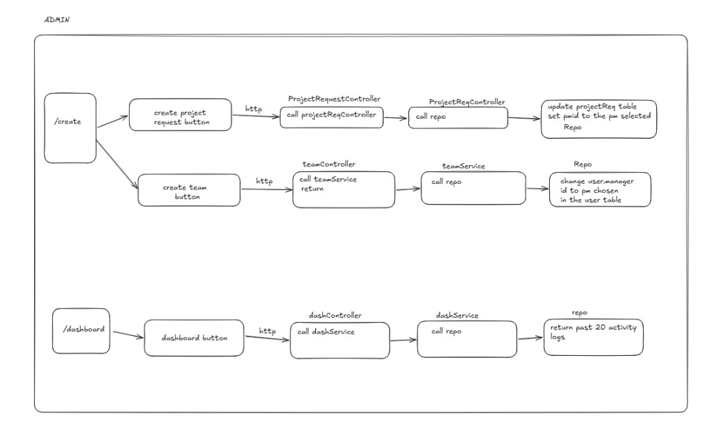
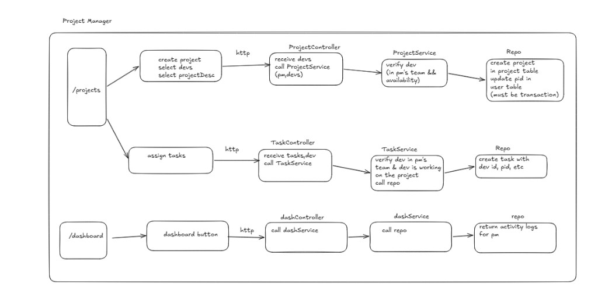
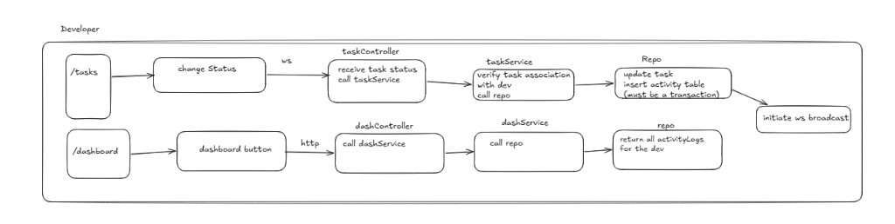
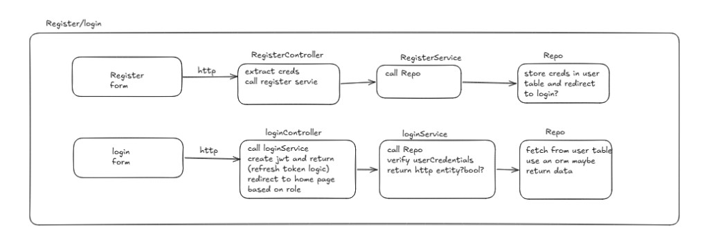
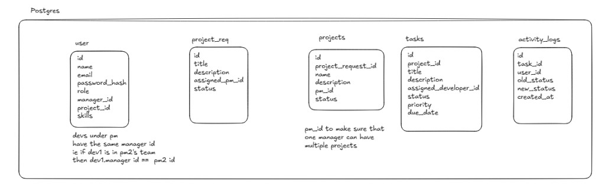

# Client Project Dashboard

A role-based dashboard for turning client work requests into internal projects, teams, and tasks. Admins make project requests and form teams. Project managers create projects and assign tasks to developer. Developers update only the tasks assigned to them. Activity is persisted in the database and later delivered in real time over WebSockets.

The app is a TypeScript monorepo: Express + Prisma + PostgreSQL in `backend/`, React + Vite in `frontend/`.

## Roles

| Role | Access |
|------|--------|
| **Admin** | Full access: project requests, teams/users, projects, global activity |
| **Project Manager (PM)** | Own projects, task assignment, activity for their team and projects |
| **Developer** | Assigned tasks only; can update status; cannot see other developers' tasks |

All three roles live in a **single `users` table**. Role is a column (`admin` \| `project_manager` \| `developer`), not a separate table per type.

## Current vs planned

**Shipped today**

- Register / login with JWT access tokens
- Admin-only routes (`POST /admin/create/project`, `POST /admin/create/team`)
- Project requests stored in Postgres, assigned only to a verified PM
- Teams expressed as `users.manager_id` (developer → PM), assigned in a single transaction
- Frontend home, login, and register pages

**Still to add** (called out where they appear below)

- Repository layer, `projects` / `tasks` / `activity_logs` tables
- 1:1 project request → project constraint
- Pending registration + admin-seeded admin accounts
- Refresh tokens (HttpOnly cookie)
- Dashboard HTTP load + WebSocket live events

## Architecture

Intended backend layering:

```
HTTP / WebSocket → Controller → Service → Repository → PostgreSQL
```

- **Controllers** parse the request, call a service, return JSON.
- **Services** own business rules, authorization checks, and transactions (for example: “this id must be a PM”, “only unassigned developers can join a team”).
- **Repositories** will own Prisma/SQL. Today services talk to Prisma directly; that split comes next.
- **HTTP** for CRUD and first dashboard load.
- **WebSocket** for later real-time activity events.

Admin routes are gated with `authMiddleware` (JWT) then `roleMiddleware("admin")`. Role on the token is **who is calling**. Services still validate ids in the **body** (PM vs developer) so an admin cannot assign a request or team member to the wrong kind of user.

### Admin



- **Create project request** — admin picks a PM; the service verifies `assigned_pm_id` is a `project_manager`, then inserts into `ProjectRequests`.
- **Create team** — admin sends a PM id and developer ids; the service verifies the PM, then sets `manager_id` only on users who are developers with `manager_id` still null, in one transaction.
- **Dashboard** (planned) — HTTP fetch of the latest 20 activity logs, then WebSocket for new events.

### Project manager



- **Create project** (planned) — PM selects developers from their team and a project request; the service checks each developer is on that PM’s team and available (`project_id` is null); then creates the project and sets those developers’ `project_id` in the **same transaction**.
- **Assign tasks** (planned) — only developers on the PM’s team who are on that project.
- **Dashboard** (planned) — activity for that PM’s projects.

### Developer



- **Change status** (planned) — WebSocket (or HTTP) to `TaskService`; the service checks the task is assigned to this developer; updates the task and writes an activity log in one transaction; then broadcasts the event.
- **Dashboard** (planned) — activity for that developer’s assigned tasks.

### Register / login



Today: hashed password in `users`, JWT access token (`sub` + `role`, 1 hour).

Planned:

- Access token + refresh token; refresh token in an **HttpOnly + Secure** cookie (no `refresh_tokens` table required)
- Employee registration creates a **pending** account; admin verifies and assigns role
- Users **cannot** self-register as admin; the admin account is seeded separately

## Data model



### Implemented

**`users`**

| Field | Meaning |
|-------|---------|
| `id`, `name`, `email`, `password_hash`, `role` | Identity |
| `manager_id` | Team: if this user is a developer, this is their PM’s `id`. A PM can have many developers. |
| `project_id` | Developer’s **current** active project. `NULL` means available. One active project at a time. |

When a project completes, the project is marked completed **and** those developers’ `project_id` values are cleared in the **same transaction** (planned with the `projects` table).

**`ProjectRequests` (`project_req`)**

Client-requested work. Admin creates it and assigns `assigned_pm_id`. The PM later uses it as the basis for an internal project.

### Planned tables

**`projects`**

- `id`, `project_request_id`, `name`, `description`, `pm_id`, `status`, timestamps
- One PM → many projects
- Intended **one project per project request** (constraint to add later)

**`tasks`**

- `id`, `project_id`, `title`, `description`, `assigned_developer_id`, `status`, `priority`, `due_date`, timestamps
- Project → many tasks; each task has one assigned developer

**`activity_logs`**

- `id`, `task_id`, `user_id`, `old_status`, `new_status`, `created_at`
- Task holds **current** status; activity log holds **history** of status changes

### Relationships

- ProjectRequest → Project (intended 1:1)
- PM 1:N Project (`projects.pm_id`)
- PM 1:N Developer (`users.manager_id`)
- Developer N:1 current Project (`users.project_id`)
- Project 1:N Task
- Task N:1 Developer
- Task 1:N ActivityLog
- User 1:N ActivityLog

## Dashboard / activity (planned)

1. First load: HTTP request for the latest **20** relevant activity logs.
2. Then: WebSocket for live events.

Visibility:

- **Admin** — global activity
- **PM** — activity from their own projects
- **Developer** — activity on their assigned tasks

## API (current)

| Method | Path | Auth | Purpose |
|--------|------|------|---------|
| `POST` | `/auth/register` | Public | Create user, return JWT |
| `POST` | `/auth/login` | Public | Verify credentials, return JWT |
| `POST` | `/admin/create/project` | Admin JWT | Create project request, assign PM |
| `POST` | `/admin/create/team` | Admin JWT | Set `manager_id` on unassigned developers |

Send `Authorization: Bearer <token>` on admin routes.

## Repo layout

```
backend/          Express, Prisma, Zod
  controllers/
  service/
  middleware/
  schema/
  prisma/
frontend/         React + Vite
  src/auth/
  src/admin/create/
  src/dashboard/
docs/architecture/   Flow and data-model diagrams
```

## Local setup

**Backend**

```bash
cd backend
npm install
# set DATABASE_URL and JWT_SECRET in .env
npx prisma migrate dev
npx prisma generate
npm run dev
```

API listens on port `3000`.

**Frontend**

```bash
cd frontend
npm install
npm run dev
```

